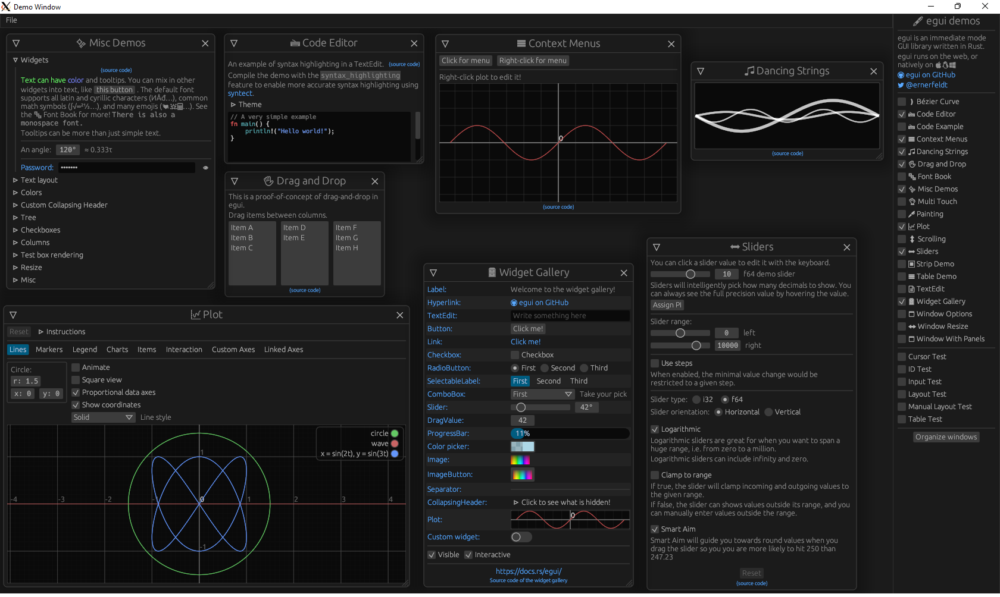

# Egui FLTK Frontend

[](https://crates.io/crates/egui-fltk-frontend)

[](https://docs.rs/egui-fltk-frontend)
[](https://github.com/Ar37-rs/egui-fltk-frontend/actions/workflows/ci.yml)

[FLTK](https://github.com/fltk-rs/fltk-rs) frontend for [egui](https://github.com/emilk/egui) [WGPU](https://github.com/gfx-rs/wgpu).

## On linux Debian/Ubuntu based distros, install latest build tools (if not installed)

```
sudo apt-get update && sudo apt-get install build-essential cmake ninja-build
```

make sure to install the latest FLTK requirements:

```
sudo apt-get update && sudo apt-get install -y libpango1.0-dev libx11-dev libxext-dev libxft-dev libxinerama-dev libxcursor-dev libxrender-dev libxfixes-dev libgl1-mesa-dev libglu1-mesa-dev
```

and egui requirements as well:

```
sudo apt-get install libxcb-render0-dev libxcb-shape0-dev libxcb-xfixes0-dev libspeechd-dev libxkbcommon-dev libssl-dev
```

## Usage

On pure wayland only desktop enable-features:

```toml
[dependencies]
egui-fltk-frontend = { version = "0.19", features = ["wayland"] }
```

Note:
on xwayland based desktop (like gnome 42+) doesn't require to enable the "wayland" features.

## Example

Running example *.rs files:

```
cargo r --example image
cargo r --example main --features="fltk-enable-glwindow"
cargo r --example smaa --features="fltk-enable-glwindow"
```

or [click here](https://github.com/Ar37-rs/egui-fltk-frontend/tree/main/examples) on how to use it inside Cargo.toml

## Screenshot

[main_example](https://github.com/Ar37-rs/egui-fltk-frontend/tree/main/examples/main_example) running on WSL2 + X Server:


